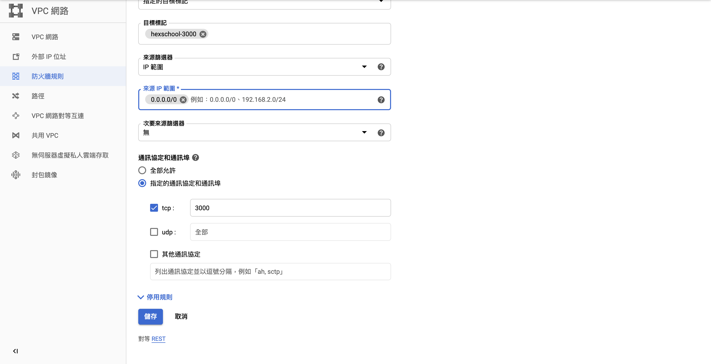

# 動手搞定GCP部署工作

> :calendar: Updated Date: 2020-05-13

> :european_post_office: Author: [YiChun Sung](https://github.com/yichunsung)

> :e-mail: [ycsung.r@elk-tree.studio](ycsung.r@elk-tree.studio)


## 現在的開發長什麼樣子？

### 專案架構

* 從MVC到前後端分離

    * 推薦文章：[跟著小明一起搞懂技術名詞：MVC、SPA 與 SSR](https://medium.com/@hulitw/introduction-mvc-spa-and-ssr-545c941669e9)

* 漸漸地把前端和後端分開，當然現在組織越大的開發團隊有越多的分工角色，專案也分開，各自在專案中的專業技術也越來越複雜。

* 舉例：


### 我們在什麼位置？

* [WEB DEVELOPER ROADMAP 2019](https://github.com/goodjack/developer-roadmap-chinese)


### 前端開發者需要了解部署的重要性

* 情境一：管Server的人非常好，也非常嚴謹，所有更新他必定是親自來，前端、API開發人員的更新都交給他統一上去。

* 情境二：管Server的人同時要管好幾個服務，即便他定義了很多嚴謹的規範，但是他沒辦法每次都及時幫忙開發人員提交更新。

* 情境三：根本沒有Server人員，只有一台機器各自表述。

* 你應該要多瞭解一些他們的事情！

### 關於Linux 

* 認識Linux也許會是精進自己的第一步，試試看吧！

* 台灣 Linux 推薦網站:

    * [鳥哥的 Linux 私房菜](http://linux.vbird.org/)

    * [酷！學園討論區](http://phorum.study-area.org/)

    * SayYA 資訊站(已結束)


## GCP常用資源介紹


* 新增一個你自己的專案吧！

    * [Google Cloud Platform](https://cloud.google.com)


* Google App Engine (GAE)

    * Google Slogan: 全代管的無伺服器應用程式平台

    * [App Engine](https://cloud.google.com/appengine/?hl=zh-tw&utm_source=google&utm_medium=cpc&utm_campaign=japac-TW-all-zh-dr-bkws-all-super-trial-e-dr-1008074&utm_content=text-ad-none-none-DEV_c-CRE_263264845082-ADGP_Hybrid+%7C+AW+SEM+%7C+BKWS+~+T1+%7C+EXA+%7C+Compute+%7C+1:1+%7C+TW+%7C+zh+%7C+app+engine+%7C+google+app+engine+%7C+en-KWID_43700031884576212-kwd-5245655962&userloc_1012825&utm_term=KW_google%20app%20engine&gclid=CjwKCAjwkun1BRAIEiwA2mJRWWmQ9js-Cuu2xI6x1Ad1SSTq24yRLUUNRsiVnd-8E18fvrO53vv8KBoCYF8QAvD_BwE)

* Google Compute Engine (GCE)
    
    * [說明頁面](https://cloud.google.com/compute/?hl=zh-tw&utm_source=google&utm_medium=cpc&utm_campaign=japac-TW-all-zh-dr-bkws-all-super-trial-e-dr-1008074&utm_content=text-ad-none-none-DEV_c-CRE_263264845157-ADGP_Hybrid+%7C+AW+SEM+%7C+BKWS+~+T1+%7C+EXA+%7C+Compute+%7C+1:1+%7C+TW+%7C+zh+%7C+compute+engine+%7C+google+compute+engine+%7C+en-KWID_43700031884576269-kwd-39467282827&userloc_1012825&utm_term=KW_google%20compute%20engine&gclid=CjwKCAjwkun1BRAIEiwA2mJRWTcchZ1SWDgcqB_URNWvjIcmbzY_LXFHtkq5eAIiMi2kaLPZTS_rMRoCzR4QAvD_BwE)

* Google Container Registry (GCR)

    * [說明頁面](https://cloud.google.com/container-registry/?utm_source=google&utm_medium=cpc&utm_campaign=japac-TW-all-en-dr-bkws-all-pkws-trial-b-dr-1008074&utm_content=text-ad-none-none-DEV_c-CRE_396470720342-ADGP_Hybrid+%7C+AW+SEM+%7C+BKWS+~+T2+%7C+BMM+%7C+Containers+%7C+M:1+%7C+TW+%7C+en+%7C+container+registry+%7C+general+-+PKWS-KWID_43700049545137467-kwd-205797627847&userloc_1012825-network_g&utm_term=KW_%2Bgoogle%20%2Bcontainer%20%2Bregistry&gclid=CjwKCAjwkun1BRAIEiwA2mJRWcQczvF2Q0CWROEMgJfpphfTRbYwTEjuev3Y9GXdjUcwMoagPmoFLRoC8KgQAvD_BwE)

* Google Kubernetes Engine (GKE)

* Google SQL

* Google Storage

* gcloud SDK (Google Cloud SDK)

    * 安裝SDK方便操作 --> [安裝頁面](https://cloud.google.com/sdk/install)

For Example: Linux & macOS:

```bash
curl https://sdk.cloud.google.com | bash
```


```bash
exec -l $SHELL
```

```bash
gcloud init
```

接著會需要登入你的google帳號跟選擇你的GCP專案。

你可以輸入指令看一下當前的專案選擇和你現在的登入帳號

```bash
gcloud config list
```

* 更多使用者文件： [Google Cloud SDK documentation](https://cloud.google.com/sdk/docs)


## 在GCE實戰開一台機器

### 在Google Compute Engine (GCE)中設定一台機器

* 開一開新的vm，選擇OS (我用Ubuntu做範例，大家可以選擇自己熟悉的)

* 進去vm的方式有很多，有最簡單的利用瀏覽器進去，也可以利用ssh直接連線或是用gcloud SDK連線ssh進去。

用 gcloud SDK進去的方式：

```bash
gcloud beta compute ssh --zone "YOUR_ZONE" "VM_NAME" --project "PROJECT_ID"
```    

* 先安裝必要的東西 - 複雜版

1. 先更新 apt

```bash
sudo apt-get update
```

2. 安裝node.js/npm

```bash
curl -sL https://deb.nodesource.com/setup_12.x | sudo -E bash -

sudo apt-get install nodejs

node --version
```

3. 安裝其他你想安裝的環境 例如 NGINX 等等

```bash
sudo apt-get install nginx -y
```

4. 把你的專案拉下來吧！

```bash
git clone "https://github.com/ElkTreeStudio/hexschool-GCP-demo"
``` 

### 靜態IP設定

> VPC 網路 > 外部IP位址 > 開啟靜態IP

### 防火牆設定

設定 port 3000




> 其實要從頭設定好一個完整的環境有時候很麻煩，運氣好的話你可以從頭到尾的安裝和運行都很順暢，然後快樂地啟用已經開發好的專案，但常常事與願違....


## Docker 化你的專案

### 為什麼建議Docker化？

1. 更快速的交付和部署
2. 更輕鬆的遷移和擴展
3. 更簡單的管理

* [Docker 官網](https://dotblogs.com.tw/explooosion/2018/09/15/194754)
* [《Docker —— 從入門到實踐­》正體中文版](https://legacy.gitbook.com/book/philipzheng/docker_practice/details)
* [為什麼要使用 Docker？](https://philipzheng.gitbooks.io/docker_practice/content/introduction/why.html)
* [Docker - 容器化 Node.js express](https://dotblogs.com.tw/explooosion/2018/09/15/194754)


4. 實作：

* 寫一個Dockerfile

```Dockerfile
FROM node:10-alpine

# Create app directory
WORKDIR /usr/src/app

# Install app dependencies
COPY package*.json ./
RUN apk --no-cache add --virtual builds-deps build-base python
RUN npm install

# Bundle app source
COPY . .

EXPOSE 3000
CMD [ "node", "index.js" ]
```

* 建立一個Docker image

```bash
docker build -t gcr.io/[your_gcp_project_id]/[your_image_name]:[tag_name] $PWD
```

例如：

```bash
docker build -t gcr.io/elk-tree-studio/hexschool_demo:0.1.0 $PWD
```

* 在本機端測試一下是否可以正確執行

```bash
docker run -p 3000:3000 --name hexschool_app -d gcr.io/elk-tree-studio/hexschool_demo:0.1.0
```

## 使用GCR 管理Docker Image

### 推上 GCP

```bash
gcloud docker -- push DOCKER_IMAGE_NAME:TAG
```

例如:

```bash
gcloud docker -- push gcr.io/elk-tree-studio/hexschool_demo:0.1.0
```

## 在GCE中簡易地使用Docker


### 安裝Docker 

* 從docker.io 安裝 docker

```bat
sudo apt-get install docker.io
```


### 從 Google Container Registry (GCR) 把 docker image 拉進來

[Authentication methods](https://cloud.google.com/container-registry/docs/advanced-authentication)

```bash
gcloud auth configure-docker
```

使用gcloud 指令將GCR的image 拉進來

```bash
gcloud docker -- pull gcr.io/elk-tree-studio/hexschool_demo:0.1.0
```

執行:

```bash
docker run -p 3000:3000 --name hexschool_app -d gcr.io/elk-tree-studio/hexschool_demo:0.1.0
```

## nginx 部署

0. 為什麼要使用nginx

    * 安全設定

    * SSL憑證

    * 多網域的設定

    * 靜態資源快取

    * 延伸閱讀： [Nginx：高效能的 Web 伺服器、反向代理、負載平衡](https://noob.tw/nginx/), 


1. 安裝 nginx


```bash
sudo apt-get install nginx -y
```

2. 確認nginx 狀態

```bash
ps auwx | grep nginx
```

3. nginx指向設定，修改設定檔

```
sudo vi /etc/nginx/sites-available/default
```

4. 修改設定如下：

```nginx
server_name yourdomain.com www.yourdomain.com;

location / {
    proxy_pass http://localhost:5000; #whatever port your app runs on
    proxy_http_version 1.1;
    proxy_set_header Upgrade $http_upgrade;
    proxy_set_header Connection 'upgrade';
    proxy_set_header Host $host;
    proxy_cache_bypass $http_upgrade;
}
```

5. 確認nginx config

```bash
sudo nginx -t
```

6. Restart nginx

```bash
sudo service nginx restart
```

7. Stop nginx

```bash
service nginx stop
```

8. Start nginx

```bash
service nginx start
```

## 網域的設定

* 以godaddy來示範

## 在Docker中使用git去做版本控制

### 進入docker container操作

```bash
docker exec -it {docker container name} bash
```

### In Alpine linux like pm2-container

* Alpine uses ash and not bash.

```bash
docker exec -it {docker container name} ash
```


## 還可以怎麼精進自己？

* 更精進Docker

    * [用30天來介紹和使用 Docker](https://ithelp.ithome.com.tw/users/20103456/ironman/1320)

    * [Docker 基本使用：看完就會架 docker 化的服務](https://ithelp.ithome.com.tw/articles/10205481)

* [學習docker-compose](https://docs.docker.com/compose/)

* 學習怎麼一次部署前後端和DB
    
* 為自己的網站設置SSL
