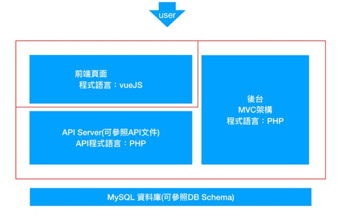
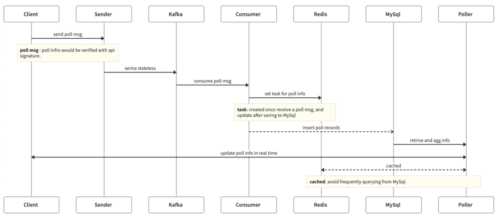
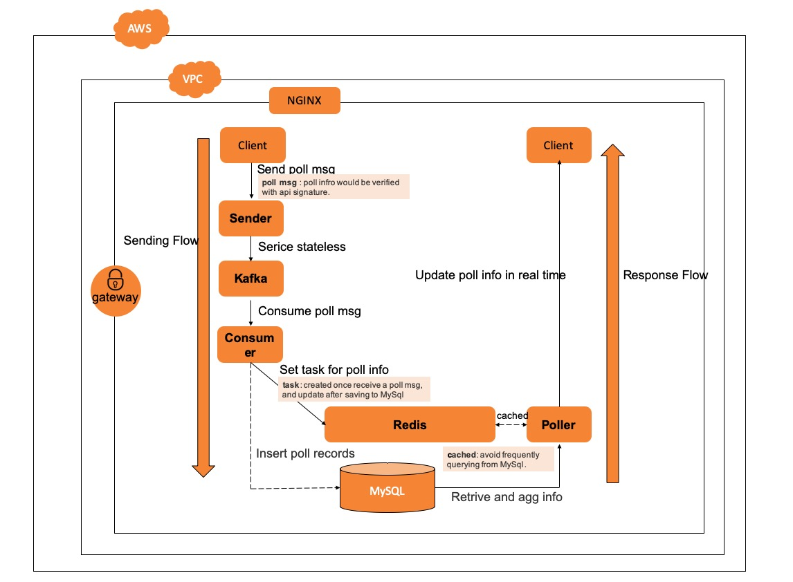
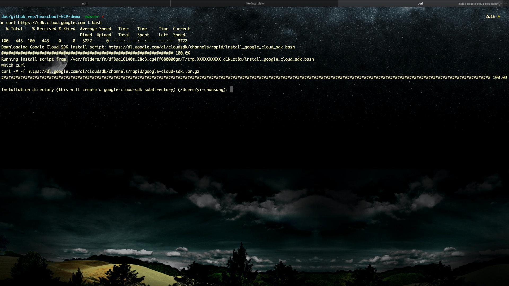
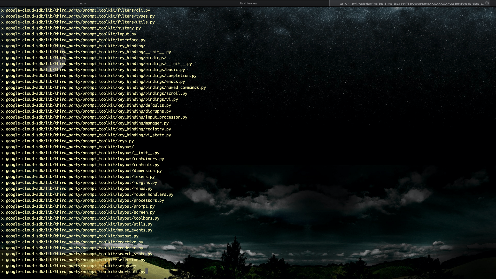

# 動手搞定GCP部署工作

### 目錄

* [現在的開發長什麼樣子？](/#)


    * [簡介目前常見的開發流程和專案架構](/#)


    * [簡介前端開發者對於部署認識的必要性](/#)


    * [我們在什麼位置？](/#)


* [GCP常用資源](/#)


    * [Google App Engine (GAE)](/#)


    * [Google Compute Engine (GCE)](/#)


    * [Google Kubernetes Engine (GKE)](/#)


    * [Google Kubernetes Engine (GKE)](/#)


    * [Google SQL](/#)


    * [Google Storage](/#)


    * [Google gcloud SDK](/#)


* [動手做-在GCE開一台機器](/#)

    * [選擇你想要的機器](/#)

    * [靜態IP設定](/#)

    * [防火牆設定](/#)

* [安裝你的機器](/#)

    * [git](/#)

    * [docker](/#)

    * [nginx](/#)

* [Docker化你的專案](/#)

    * [為什麼建議Docker化](/#)

    * [撰寫簡單的Dockerfile](/#)

    * [打包一個image](/#)

    * [測試Docker](/#)

* [使用GCR 管理Docker Image](/#)

    * [推上去GCP](/#)

* [在GCE中簡單地使用Docker](/#)

    * [把你的image拉下來](/#)

    * [測試你的Docker跑不跑得起來](/#)

* [網域設定](/#)

    * [以godaddy來示範](/#)

* [使用NGINX](/#)

    * [為什麼要用nginx？](/#)

    * [nginx指向設定](/#)

* [在Docker中操作git](/#)

* [還可以怎麼精進自己？](/#)

    * [學習docker-compose](/#)

    * [學習怎麼一次部署前後端和DB](/#)
		
    * [為自己的網站設置SSL](/#)

## 現在的開發長什麼樣子？

### 專案架構

* 從MVC到前後端分離

    * 推薦文章：[跟著小明一起搞懂技術名詞：MVC、SPA 與 SSR](https://medium.com/@hulitw/introduction-mvc-spa-and-ssr-545c941669e9)

* 漸漸地把前端和後端分開，當然現在組織越大的開發團隊有越多的分工角色，專案也分開，各自在專案中的專業技術也越來越複雜。

* 舉例：







### 我們在什麼位置？

* [WEB DEVELOPER ROADMAP 2019](https://github.com/goodjack/developer-roadmap-chinese)


### 前端開發者需要了解部署的重要性

情境一：管Server的人非常好，也非常嚴謹，所有更新他必定是親自來，前端、API開發人員的更新都交給他統一上去。

情境二：管Server的人同時要管好幾個服務，即便他定義了很多嚴謹的規範，但是他沒辦法每次都及時幫忙開發人員提交更新。

情境三：根本沒有Server人員，只有一台機器各自表述。


## GCP常用資源介紹

* 新增一個你自己的專案吧！

    [Google Cloud Platform](https://www.googleadservices.com/pagead/aclk?sa=L&ai=DChcSEwjygvObnLDpAhUFwRYFHdJiATYYABABGgJ0bA&ohost=www.google.com&cid=CAESQeD2VsWW1VHMXkhOwueQLazDWeKGtKez2qUDrqDWWgoC_81K91-tLyYBHniEIq1B0KVHqWMzkP-hwBTnXQ1aco-9&sig=AOD64_1YHcV81ig-3Qdl2MIz2mW1N9-AXQ&q=&ved=2ahUKEwiv8OmbnLDpAhUmw4sBHSmXCOwQ0Qx6BAgYEAE&adurl=)


* Google App Engine (GAE)

    * Google Slogan: 全代管的無伺服器應用程式平台

    * [App Engine](https://cloud.google.com/appengine/?hl=zh-tw&utm_source=google&utm_medium=cpc&utm_campaign=japac-TW-all-zh-dr-bkws-all-super-trial-e-dr-1008074&utm_content=text-ad-none-none-DEV_c-CRE_263264845082-ADGP_Hybrid+%7C+AW+SEM+%7C+BKWS+~+T1+%7C+EXA+%7C+Compute+%7C+1:1+%7C+TW+%7C+zh+%7C+app+engine+%7C+google+app+engine+%7C+en-KWID_43700031884576212-kwd-5245655962&userloc_1012825&utm_term=KW_google%20app%20engine&gclid=CjwKCAjwkun1BRAIEiwA2mJRWWmQ9js-Cuu2xI6x1Ad1SSTq24yRLUUNRsiVnd-8E18fvrO53vv8KBoCYF8QAvD_BwE)

* Google Compute Engine (GCE)
    
    * [說明頁面](https://cloud.google.com/compute/?hl=zh-tw&utm_source=google&utm_medium=cpc&utm_campaign=japac-TW-all-zh-dr-bkws-all-super-trial-e-dr-1008074&utm_content=text-ad-none-none-DEV_c-CRE_263264845157-ADGP_Hybrid+%7C+AW+SEM+%7C+BKWS+~+T1+%7C+EXA+%7C+Compute+%7C+1:1+%7C+TW+%7C+zh+%7C+compute+engine+%7C+google+compute+engine+%7C+en-KWID_43700031884576269-kwd-39467282827&userloc_1012825&utm_term=KW_google%20compute%20engine&gclid=CjwKCAjwkun1BRAIEiwA2mJRWTcchZ1SWDgcqB_URNWvjIcmbzY_LXFHtkq5eAIiMi2kaLPZTS_rMRoCzR4QAvD_BwE)

* Google Container Registry (GCR)

    * [說明頁面](https://cloud.google.com/container-registry/?utm_source=google&utm_medium=cpc&utm_campaign=japac-TW-all-en-dr-bkws-all-pkws-trial-b-dr-1008074&utm_content=text-ad-none-none-DEV_c-CRE_396470720342-ADGP_Hybrid+%7C+AW+SEM+%7C+BKWS+~+T2+%7C+BMM+%7C+Containers+%7C+M:1+%7C+TW+%7C+en+%7C+container+registry+%7C+general+-+PKWS-KWID_43700049545137467-kwd-205797627847&userloc_1012825-network_g&utm_term=KW_%2Bgoogle%20%2Bcontainer%20%2Bregistry&gclid=CjwKCAjwkun1BRAIEiwA2mJRWcQczvF2Q0CWROEMgJfpphfTRbYwTEjuev3Y9GXdjUcwMoagPmoFLRoC8KgQAvD_BwE)

* Google Kubernetes Engine (GKE)

* Google SQL

* Google Storage

### gcloud SDK (Google Cloud SDK)

* 安裝SDK方便操作 --> [安裝頁面](https://cloud.google.com/sdk/install)

For Example: Linux & macOS:

```bash
curl https://sdk.cloud.google.com | bash
```






```bash
exec -l $SHELL
```

```bash
gcloud init
```

接著會需要登入你的google帳號跟選擇你的GCP專案。


## 在GCE實戰開一台機器 

## Docker 化你的專案

### 為什麼建議Docker化？

1. 更快速的交付和部署
2. 更輕鬆的遷移和擴展
3. 更簡單的管理

* [Docker 官網](https://dotblogs.com.tw/explooosion/2018/09/15/194754)
* [《Docker —— 從入門到實踐­》正體中文版](https://legacy.gitbook.com/book/philipzheng/docker_practice/details)
* [為什麼要使用 Docker？](https://philipzheng.gitbooks.io/docker_practice/content/introduction/why.html)
* [Docker - 容器化 Node.js express](https://dotblogs.com.tw/explooosion/2018/09/15/194754)

## 使用GCR 管理Docker Image

## 在GCE中簡易地使用Docker

## nginx 部署

## 網域的設定

## 在Docker中使用git去做版本控制

## 持續未完成可以探索的挑戰


